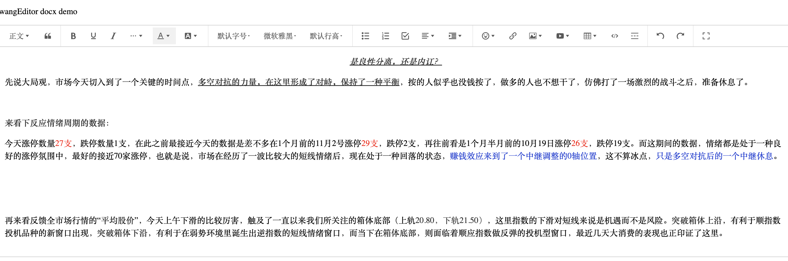
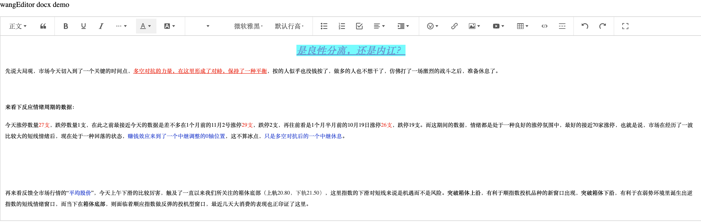

# wangEditor docx

## 介绍

[wangEditor](https://www.wangeditor.com/) word插件，支持从Microsoft Word/WPS粘贴过来保留样式。

<!--  -->

Before



After



## 安装

```shell
yarn add wangeditor-plugin-docx
```

## 使用

### 注册到编辑器

```js
import { Boot, IEditorConfig, IToolbarConfig } from '@wangeditor/editor'
import docxPlugin from 'wangeditor-plugin-docx'

// 注意，要在创建编辑器之前注册，且只能注册一次，不可重复注册。
Boot.registerModule(docxPlugin)
```

*说明：本插件并没有支持所有的元素，比如table中的样式，如果有需要支持的可以考虑提feature*
